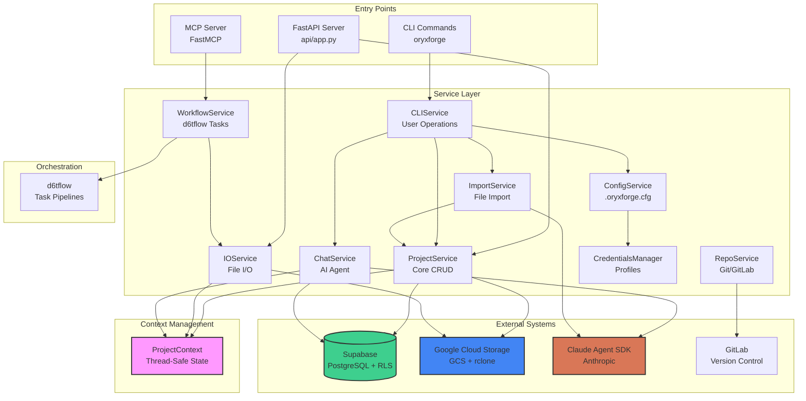

# OryxForge Architecture Documentation

**Version:** 1.0
**Last Updated:** 2025-10-17

This document provides a comprehensive architectural overview of the OryxForge system, designed to help developers understand the system design, component interactions, and key workflows.

---

## Table of Contents

1. [System Overview](#system-overview)
2. [High-Level Architecture](#high-level-architecture)
3. [Service Layer](#service-layer)
4. [Key Workflows](#key-workflows)
5. [Deployment Modes](#deployment-modes)
6. [Data Model](#data-model)
7. [Integration Points](#integration-points)
8. [Design Patterns](#design-patterns)
9. [Security Model](#security-model)

---

## System Overview

OryxForge is a **data science workflow platform** that combines:
- **Project & Dataset Management**: Organize data science work into projects and datasets
- **AI-Assisted Data Exploration**: Chat with Claude to analyze, visualize, and transform data
- **Workflow Orchestration**: Use d6tflow for reproducible task pipelines
- **Cloud-Native Storage**: Leverage Supabase (PostgreSQL) and GCS for scalable storage
- **Multi-Modal Deployment**: CLI for local development, FastAPI for web/API access, serverless for production

**Key Capabilities:**
- Import data files and get AI-generated insights
- Chat with Claude to explore and analyze datasets
- Generate and execute d6tflow workflow tasks
- Save/load DataFrames, charts, and markdown reports
- Git integration for version control
- Multi-tenant isolation with row-level security

---

## High-Level Architecture



### Architecture Layers

1. **Entry Layer**: User-facing interfaces (CLI, API, MCP server)
2. **Service Layer**: Business logic organized into 13 specialized services
3. **Context Layer**: Thread-safe request/session state management
4. **Data Layer**: Persistence (Supabase) and file storage (GCS)
5. **Integration Layer**: External systems (Claude, GitLab, d6tflow)

---

## Service Layer

### Service Dependencies


### Service Catalog

| Service | File | Responsibilities | Key Methods |
|---------|------|------------------|-------------|
| **ProjectContext** | env_config.py | Thread-safe request context management | `set()`, `get()`, `clear()`, `is_api_mode()` |
| **ProjectService** | project_service.py | Core project/dataset/sheet CRUD, mount operations | `ds_create()`, `sheet_create()`, `ds_list()`, `mount()`, `unmount()` |
| **IOService** | io_service.py | File I/O: DataFrames (Parquet), charts, markdown | `save_df_pd()`, `load_df_pd()`, `save_chart_plotly()`, `load_task()` |
| **ChatService** | chat_service.py | Claude Agent conversations with mode-based prompting | `chat()` with session management |
| **CLIService** | cli_service.py | User-facing CLI operations, profile/config management | `project_activate()`, `import_file()`, `chat()`, `mode_set()` |
| **ConfigService** | config_service.py | .oryxforge.cfg file management | `get()`, `set()`, `get_all()`, `validate_mount_point()` |
| **CredentialsManager** | iam.py | Profile storage (user_id, project_id) in adtiam | `set_profile()`, `get_profile()`, `clear_profile()` |
| **RepoService** | repo_service.py | GitLab repository management | `create_repo()`, `clone()`, `ensure_repo()`, `push()` |
| **WorkflowService** | workflow_service.py | d6tflow task code generation and execution | `upsert_eda()`, `upsert_run()`, `run_task()`, `run_flow()` |
| **ImportService** | import_service.py | File import orchestration with Claude insights | `import_file()`, `download()`, `save_insight()` |
| **DFService** | df_service.py | DataFrame analysis utilities | `describe_pd()` |
| **Utils** | utils.py | Shared utilities | `init_supabase_client()`, `get_project_data()` |
| **Agent** | agents/agent.py | Claude Agent SDK wrapper | `query_run()` with tool permissions |

### Zero-Parameter Service Pattern

All services follow the **zero-parameter pattern**: they retrieve configuration from `ProjectContext` instead of accepting user_id/project_id as parameters.

```python
# ✅ CORRECT - Uses ProjectContext
from oryxforge.services.project_service import ProjectService
from oryxforge.services.env_config import ProjectContext

# Set context once
ProjectContext.set(working_dir="/path/to/project",
                   user_id="user-uuid",
                   project_id="project-uuid")

# Services automatically use context
service = ProjectService()
datasets = service.ds_list()  # Filters by context.user_id and context.project_id

# ❌ INCORRECT - Parameters override context (avoided)
def create_dataset(name: str, user_id: str, project_id: str):
    # Don't pass these as parameters!
    pass
```

---

## Key Workflows

### 1. Project Creation & Initialization


**Key Points:**
- `ProjectContext.set()` is called early but with `write_config=False`
- Repository is cloned/pulled into the working directory
- `ProjectContext.write_config()` is called AFTER repo is ready
- Config file (`.oryxforge.cfg`) is written to working directory
- Profile stored in adtiam for credential management

---

### 2. Data Save/Load Flow


**Key Points:**
- All exploration data saved to `{mount_point}/exploration/{sheet}.parquet`
- Datasheet records store `uri` (relative path) for file resolution
- Load operation splits on `"."` to extract dataset and sheet names
- Custom datasets trigger d6tflow task execution
- Metadata stored in Supabase, files stored in GCS

---

### 3. Chat Interaction with Claude


**Key Points:**
- Session ID = project_id for conversation continuity
- Mode-based prompting (explore, edit, plan) guides Claude's behavior
- MCP tools expose OryxForge operations to Claude
- Chat history persisted to `chat_messages` table
- Automatic git commit after each interaction
- Cost and duration tracked in metadata

---

### 4. File Import Processing


**Key Points:**
- Creates `data_sources` entry with `local://` URI
- Links imported file to "Sources" dataset
- Claude generates initial insight about the data
- Insight stored separately in `insights` table
- Status tracking throughout import lifecycle

---

## Deployment Modes

OryxForge operates in three distinct deployment modes, automatically detected via environment variables:

### Mode Detection Logic

```python
# From env_config.py
if os.getenv("GOOGLE_CLOUD_PROJECT"):
    # GCP Serverless Mode
    working_dir = f"/tmp/{user_id}/{project_id}"
elif os.getenv("ORYX_MOUNT_ROOT"):
    # Local API Mode
    working_dir = f"{ORYX_MOUNT_ROOT}/mnt/projects/{user_id}/{project_id}"
else:
    # CLI Mode
    working_dir = os.getcwd()
```

### 1. CLI Mode (Local Development)


**Characteristics:**
- Working directory = user's current directory (`os.getcwd()`)
- Config stored in `.oryxforge.cfg` (project root)
- rclone mount persistent during session
- Files written locally and synced to GCS
- Full git operations (clone, commit, push)

**Use Case:** Developer working on data science projects locally

---

### 2. Local API Mode (Development Server)

```mermaid
graph TB
    subgraph "Development Server"
        FastAPI[FastAPI Server]
        Uvicorn[Uvicorn]
        MountRoot[ORYX_MOUNT_ROOT<br/>/mnt/projects]

        Uvicorn --> FastAPI
    end

    subgraph "Per-Request Context"
        WorkingDir[/mnt/projects/{user_id}/{project_id}]
        RcloneMount[rclone mount<br/>Persistent]
    end

    subgraph "External Services"
        Supabase[(Supabase)]
        GCS[GCS Bucket]
        GitLab[GitLab]
    end

    FastAPI --> WorkingDir
    WorkingDir --> RcloneMount
    RcloneMount --> GCS
    FastAPI --> Supabase
    FastAPI --> GitLab

    style MountRoot fill:#fff3cd
```

**Characteristics:**
- Working directory = `{ORYX_MOUNT_ROOT}/mnt/projects/{user_id}/{project_id}`
- Mount point persistent across requests
- No `.oryxforge.cfg` file (context from request headers)
- Multi-tenant with path isolation
- rclone daemon mode (single mount for all users)

**Use Case:** Local development API server with persistent mounts

---

### 3. GCP Serverless Mode (Production)

```mermaid
graph TB
    subgraph "Cloud Run Container (Ephemeral)"
        Container[Container Instance]
        API[FastAPI]
        TmpDir[/tmp/{user_id}/{project_id}]
        RcloneProc[rclone mount<br/>Per-Request]

        Container --> API
        API --> TmpDir
        API --> RcloneProc
    end

    subgraph "GCP Services"
        GCS[GCS Bucket<br/>gs://oryx-forge-datasets-dev]
        SecretMgr[Secret Manager]
        PubSub[Pub/Sub]
    end

    subgraph "External Services"
        Supabase[(Supabase)]
        GitLab[GitLab]
        Anthropic[Anthropic API]
    end

    API --> Supabase
    RcloneProc --> GCS
    API --> SecretMgr
    API --> GitLab
    API --> Anthropic

    Note1[Container resets<br/>frequently]
    Note2[All state in<br/>Supabase/GCS]

    style Container fill:#ffe6e6
    style Note1 fill:#ffcccc
    style Note2 fill:#ffcccc
```

**Characteristics:**
- Working directory = `/tmp/{user_id}/{project_id}` (ephemeral)
- No local config files
- Context from request headers (user_id, project_id)
- rclone mount created/verified per-request
- Container resets → no persistent state
- All data in Supabase and GCS

**Design Implications:**
1. **Stateless Operations**: Every request must be self-contained
2. **Quick Initialization**: Services initialize from context, not config files
3. **Idempotent**: Operations can be safely retried
4. **No Local Caching**: Query Supabase fresh on each request
5. **Mount Management**: Verify/create mount at API startup

**Use Case:** Production API serving multiple users at scale

---

## Data Model

### Database Schema (Supabase/PostgreSQL)


### Row-Level Security (RLS)

All tables enforce multi-tenant isolation via RLS policies:

```sql
-- Example RLS policy (applied to all tables)
CREATE POLICY "Users can only access their own data"
ON datasets
FOR ALL
USING (user_owner = auth.uid());
```

**Key Points:**
- Every table has `user_owner` column
- Supabase automatically filters queries by authenticated user
- No explicit WHERE clauses needed for tenant isolation
- Service layer still filters by `context.user_id` for clarity

### File Storage Paths (GCS)

```
gs://oryx-forge-datasets-dev/
└── {user_id}/
    └── {project_id}/
        ├── exploration/
        │   ├── Sheet1.parquet
        │   ├── Sheet2.parquet
        │   └── Chart1.json
        ├── dataset_name/
        │   ├── TaskOutput.parquet
        │   └── Analysis.md
        └── tasks/
            ├── exploration.py
            └── dataset_name.py
```

**URI Format in Datasheets:**
- Stored: `"exploration/Sheet1.parquet"` (relative)
- Resolved: `{mount_point}/exploration/Sheet1.parquet`
- GCS Path: `gs://bucket/{user_id}/{project_id}/exploration/Sheet1.parquet`

---

## Integration Points

### 1. Claude Agent SDK


**Agent Configuration:**
```python
# From agents/agent.py
agent = Agent(
    api_key=llm_api_key,
    system_prompt=context_prompt,
    tool_permissions=["Read", "Write", "Edit", "Bash", "Glob", "Grep", "mcp__oryxforge"]
)
```

**MCP Tools Exposed to Claude:**
- `code_upsert_eda()` - Create/update EDA code
- `code_read_eda()` - Read existing EDA code
- `code_upsert_run()` - Create/update workflow code
- `workflow_run_eda()` - Execute EDA tasks
- `workflow_run_flow()` - Execute full workflow
- `project_list_datasets()` - List datasets
- `project_create_sheet()` - Create new datasheet
- `df_describe()` - Analyze DataFrame

**Session Management:**
- `session_id = project_id` for conversation continuity
- Chat history stored in `chat_messages` table
- Resumable conversations across CLI invocations

---

### 2. Supabase Integration


**Initialization Pattern:**
```python
# From utils.py
def init_supabase_client():
    url = os.getenv("SUPABASE_URL")
    key = os.getenv("SUPABASE_KEY")
    return create_client(url, key)
```

**Query Pattern with RLS:**
```python
supabase = init_supabase_client()
result = supabase.table("datasets") \
    .select("*") \
    .eq("project_id", context.project_id) \
    .eq("user_owner", context.user_id) \
    .execute()
```

---

### 3. Google Cloud Storage with rclone


**Mount Management:**
```python
# From project_service.py
def mount(self) -> Dict[str, Any]:
    """Mount GCS bucket using rclone."""
    if sys.platform == "win32":
        # Windows: PowerShell Start-Process
        subprocess.Popen([
            "powershell", "-Command",
            f"rclone mount {gcs_path} {mount_point} ..."
        ])
    else:
        # Linux/macOS: daemon mode
        subprocess.Popen([
            "rclone", "mount", gcs_path, mount_point,
            "--daemon", ...
        ])
```

**Platform-Specific Behavior:**
- **Windows**: PowerShell background process, WinFSP driver
- **Linux/macOS**: daemon mode with FUSE
- **GCP Serverless**: On-demand mount verification

---

### 4. GitLab Integration


**Repository Lifecycle:**
1. **Project Creation**: `RepoService.create_repo()` → GitLab API
2. **Project Activation**: `RepoService.ensure_repo()` → clone or pull
3. **Chat Interaction**: Auto-commit and push changes
4. **Manual Operations**: `oryxforge git push`, `oryxforge git pull`

**Authentication:**
- GitLab Personal Access Token stored in adtiam
- Token-based HTTPS authentication (not SSH)

---

### 5. d6tflow Integration


**Workflow Generation:**
```python
# WorkflowService.upsert_eda() generates:
class MyTask(d6tflow.tasks.TaskPqPandas):
    def run(self):
        # User-defined transformation
        df = pd.DataFrame(...)
        self.save(df)
```

**Dynamic Execution:**
```python
# IOService.load_task() dynamically imports and runs:
module = importlib.import_module(f"tasks.{dataset_name}")
task = getattr(module, sheet_name)()
d6tflow.run(task)
```

---

## Design Patterns

### 1. Zero-Parameter Services

**Problem:** Passing user_id/project_id as parameters to every method is verbose and error-prone.

**Solution:** Use `ProjectContext` (thread-safe context variable) to store request-scoped state.

```python
# ✅ Service retrieves context internally
class ProjectService:
    def ds_list(self) -> List[Dict[str, Any]]:
        context = ProjectContext.get()
        return supabase.table("datasets") \
            .eq("user_owner", context.user_id) \
            .execute().data

# ❌ Avoid parameter passing
def ds_list(user_id: str, project_id: str) -> List[Dict[str, Any]]:
    pass
```

---

### 2. URI-Based File Resolution

**Problem:** Need platform-agnostic file paths that work across CLI, API, and serverless.

**Solution:** Store relative URIs in database, resolve to absolute paths at runtime.

```python
# Storage
sheet = {
    "uri": "exploration/MySheet.parquet"  # Relative
}

# Resolution
context = ProjectContext.get()
path = Path(context.mount_point) / sheet["uri"]  # Absolute
```

---

### 3. Mode-Based Prompting

**Problem:** Claude needs different behaviors for explore, edit, and plan modes.

**Solution:** Inject mode-specific instructions into system prompt.

```python
# From chat_service.py
if mode == "explore":
    prompt += "Focus on data analysis and visualization..."
elif mode == "edit":
    prompt += "Make direct code changes..."
elif mode == "plan":
    prompt += "Provide step-by-step plan..."
```

---

### 4. Lazy Mount Verification

**Problem:** rclone mounts may fail or disconnect, especially in serverless environments.

**Solution:** Verify mount on each request, remount if necessary.

```python
# From project_service.py
def __init__(self):
    if not self._is_mount_valid():
        self.mount()
```

---

### 5. Session-Based Chat History

**Problem:** Need conversation continuity across CLI invocations.

**Solution:** Use `project_id` as `session_id`, load history from database.

```python
# From agents/agent.py
messages = supabase.table("chat_messages") \
    .select("role, content") \
    .eq("session_id", project_id) \
    .order("created_at") \
    .execute().data
```

---

## Security Model

### Multi-Tenancy with RLS


**Security Layers:**

1. **Authentication**: Supabase JWT tokens
2. **Authorization**: RLS policies on all tables
3. **Tenant Isolation**: `user_owner` column enforces data separation
4. **Service Layer**: Additional filtering by `context.user_id` for clarity
5. **File Isolation**: GCS paths include `{user_id}/{project_id}`

**Credentials Management:**
- Sensitive credentials stored in adtiam (encrypted credential manager)
- Environment variables for API keys (Supabase, Claude, GitLab)
- No secrets in code or config files

---

## Summary

OryxForge is a **cloud-native, AI-assisted data science platform** with:

✅ **Modular Architecture**: 13 specialized services, each handling one domain
✅ **Multi-Modal Deployment**: CLI, FastAPI, and GCP serverless
✅ **Serverless-Ready**: Stateless design, ephemeral containers, quick initialization
✅ **Zero-Parameter Pattern**: Context-based configuration, no parameter passing
✅ **Multi-Tenant Isolation**: RLS for security, path isolation for files
✅ **AI Integration**: Claude Agent SDK with MCP tools for natural language interaction
✅ **Version Control**: Automatic GitLab integration with commit tracking
✅ **Workflow Orchestration**: d6tflow for reproducible task pipelines
✅ **Platform Agnostic**: Windows, Linux, macOS support

**Next Steps for Developers:**
1. Review [CLAUDE.md](./CLAUDE.md) for coding guidelines
2. Review [TESTING.md](./TESTING.md) for testing standards
3. Explore service implementations in `oryxforge/services/`
4. Run tests: `make test` or `pytest oryxforge/tests/`
5. Try CLI: `oryxforge --help`

---

**For Questions or Contributions:**
- Check existing service patterns in codebase
- Review test examples for integration patterns
- Consult documentation for API specifications
